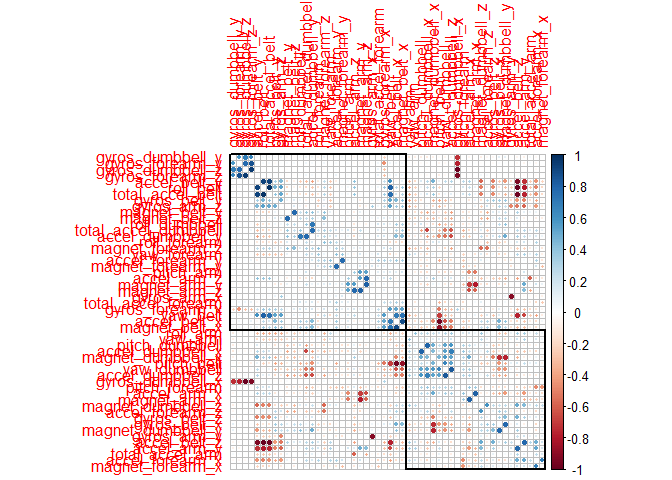

## Introduction

The quantified self movement, empowered by wearable technology like Fitbits and Jawbone Ups, focuses on tracking the quantity of exercise. However, the quality of movement remains largely unquantified. This research addresses this gap by analyzing the execution of barbell lifts.

I use accelerometer data from six participants performing barbell lifts correctly and incorrectly across five variations. Data was collected from sensors on the belt, forearm, arm, and dumbbell. This detailed dataset allows for a granular analysis of movement mechanics during weight training, promising insights into personalized fitness and injury prevention.

## Method

### Load data and packages

First of all, the data are downloaded directly from the link for [training](%22https://d396qusza40orc.cloudfront.net/predmachlearn/pml-training.csv%22) and [testing](%22https://d396qusza40orc.cloudfront.net/predmachlearn/pml-testing.csv%22) datasets. Then, the *tidyverse*, *rpart*, *randomforest* and *caret* packages were loaded.


### Data cleaning

First, the training data is sampled into training and validation sets.


Next, the acceleration measurements of belt, forearm, arm, and dumbbell are selected as predictors. Then, the missing values are checked for the outcome and predictor variables. Columns with missing values are dropped


### Exploratory data analysis

Correlation plot with hierarchical cluster is drawn to see the correlation between the predictors.


``` r
cor <- cor(training[,-53])
corrplot::corrplot(cor, order = 'hclust', diag = F, addrect = 2)
```



### Preparing data

The principal component analysis is applied to the predictors with a threshold to explain 80% of variation among the predictors.


``` r
pca <- preProcess(training,method = "pca", thresh = 0.8)
pca
```

```
## Created from 13737 samples and 53 variables
## 
## Pre-processing:
##   - centered (52)
##   - ignored (1)
##   - principal component signal extraction (52)
##   - scaled (52)
## 
## PCA needed 12 components to capture 80 percent of the variance
```

``` r
train.pca <- predict(pca, training)
validation.pca <- predict(pca, validation)
testing.pca <- predict(pca, testing)
```

PCA needed 12 components to capture 80 percent of the variance among the predictors. Pre-processed sets for training, validation and testing data are produced.

### Model training

Decision tree model and random forest model are trained with the processed training set. In random forest model, re-sampling by three-fold cross-validation is used to get the model.


### Validation
The trained models are used to test on the validation set.


``` r
tree.predict <- predict(model.tree, newdata = validation.pca)
confusionMatrix(tree.predict, validation.pca$classe)
```

```
## Confusion Matrix and Statistics
## 
##           Reference
## Prediction   A   B   C   D   E
##          A 615 201 254  58 190
##          B  35 170  14  54 113
##          C 416 242 430 234 220
##          D  67 108  16 167  51
##          E  39  77   9 140 220
## 
## Overall Statistics
##                                          
##                Accuracy : 0.387          
##                  95% CI : (0.3721, 0.402)
##     No Information Rate : 0.2831         
##     P-Value [Acc > NIR] : < 2.2e-16      
##                                          
##                   Kappa : 0.2228         
##                                          
##  Mcnemar's Test P-Value : < 2.2e-16      
## 
## Statistics by Class:
## 
##                      Class: A Class: B Class: C Class: D Class: E
## Sensitivity            0.5247  0.21303   0.5947  0.25574  0.27708
## Specificity            0.7631  0.93537   0.6746  0.93060  0.92080
## Pos Pred Value         0.4666  0.44041   0.2789  0.40831  0.45361
## Neg Pred Value         0.8026  0.83271   0.8872  0.86974  0.84295
## Prevalence             0.2831  0.19275   0.1746  0.15773  0.19179
## Detection Rate         0.1486  0.04106   0.1039  0.04034  0.05314
## Detection Prevalence   0.3184  0.09324   0.3725  0.09879  0.11715
## Balanced Accuracy      0.6439  0.57420   0.6347  0.59317  0.59894
```

``` r
rf.predict <- predict(model.rf, newdata = validation.pca)
confusionMatrix(rf.predict, validation.pca$classe)
```

```
## Confusion Matrix and Statistics
## 
##           Reference
## Prediction    A    B    C    D    E
##          A 1172    0    0    0    0
##          B    0  798    0    0    0
##          C    0    0  723    0    0
##          D    0    0    0  653    0
##          E    0    0    0    0  794
## 
## Overall Statistics
##                                      
##                Accuracy : 1          
##                  95% CI : (0.9991, 1)
##     No Information Rate : 0.2831     
##     P-Value [Acc > NIR] : < 2.2e-16  
##                                      
##                   Kappa : 1          
##                                      
##  Mcnemar's Test P-Value : NA         
## 
## Statistics by Class:
## 
##                      Class: A Class: B Class: C Class: D Class: E
## Sensitivity            1.0000   1.0000   1.0000   1.0000   1.0000
## Specificity            1.0000   1.0000   1.0000   1.0000   1.0000
## Pos Pred Value         1.0000   1.0000   1.0000   1.0000   1.0000
## Neg Pred Value         1.0000   1.0000   1.0000   1.0000   1.0000
## Prevalence             0.2831   0.1928   0.1746   0.1577   0.1918
## Detection Rate         0.2831   0.1928   0.1746   0.1577   0.1918
## Detection Prevalence   0.2831   0.1928   0.1746   0.1577   0.1918
## Balanced Accuracy      1.0000   1.0000   1.0000   1.0000   1.0000
```

It is clear that the random forest model has far better accuracy, with even 100%. So , it is selected to predict the testing data.

## Result

The random forest model is used to solve the problem given by testing data of 20 observation.


``` r
rf.predict.result <- predict(model.rf,newdata =  testing.pca)
print("Result of the predictions by Random forest model:")
```

```
## [1] "Result of the predictions by Random forest model:"
```

``` r
rf.predict.result
```

```
##  [1] A A A A A E D B A A A C B A E E A B B B
## Levels: A B C D E
```


``` r
ggplot(as.data.frame(table(rf.predict.result)), aes(rf.predict.result,Freq))+
    geom_col(aes(fill = rf.predict.result))+
    scale_fill_manual(values = RColorBrewer::brewer.pal(n = 5, name = "Accent"))+
    labs(x = "Classe", y = "Count")+
    theme_bw()+
    theme(legend.position = "")
```


